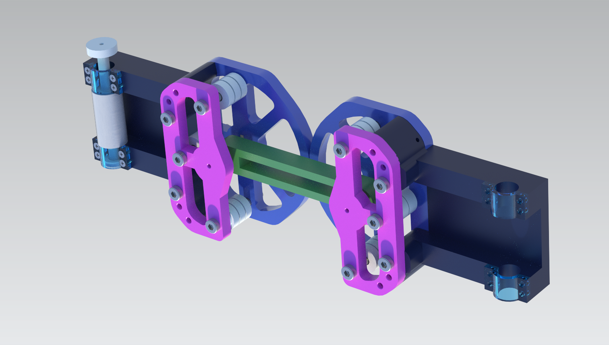

Cable-Driven Robotic Elbow Joint# Cable-Driven Robotic Elbow Joint

## 📽️ [Project Video](https://youtu.be/QoD9Po_Yc74)  
Click the link above to watch the project in action on YouTube!  

---

## 🛠️ Project Overview

This project showcases the design and implementation of a **cable-driven robotic elbow joint** inspired by human arm dynamics. The goal was to achieve high stiffness and low inertia using a **tension amplification mechanism**, making it suitable for robotics applications such as human-robot collaboration and lightweight manipulators.

---

## 🔍 Features
- **Tension Amplification Mechanism**: Increases joint stiffness quadratically, maintaining low mass and inertia.  
- **Lightweight Design**: Combines 3D-printed components and aluminum alloy for reduced weight.

---

## 📐 Design Details
- **Tools Used**: Siemens NX for CAD modeling and mechanical design.

---

## 📂 Repository Contents
This repository contains the 3D model files for the cable-driven robotic elbow joint.

## 📄 References
- [Design of Low Inertia Manipulator with High Stiffness and Strength Using Tension Amplifying Mechanisms](https://www.cs.cmu.edu/~cga/c/0749.pdf)
- [3D-Printed LIMS2-AMBIDEX Style Robotic Joint](https://www.youtube.com/watch?v=6QEgNbaDCjw)
